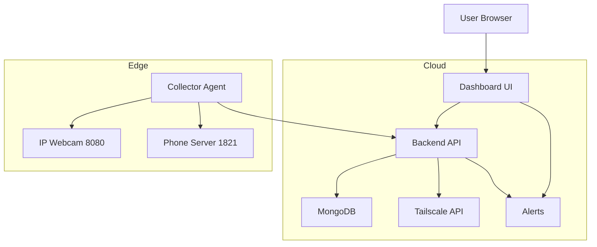
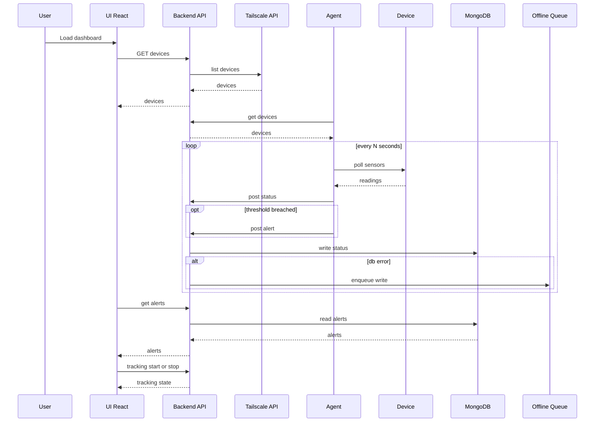

# System Design

This document outlines the major components in the Mach Dashboard system and how they interact. It includes a high-level component diagram and a request flow sequence diagram.

## Components Overview

Key notes

- Backend endpoint sources (FastAPI):
  - `GET /api/devices` discovers via Tailscale Admin API when configured; otherwise falls back to Mongo. See `src/omnivision/mach-dashboard-backend/app.py:221`.
  - `GET /api/alerts`, `POST /api/alerts` to read/write alerts. See `src/omnivision/mach-dashboard-backend/app.py:379` and `src/omnivision/mach-dashboard-backend/app.py:407`.
  - `POST /api/status` ingests time-series status from the agent. See `src/omnivision/mach-dashboard-backend/app.py:421`.
  - `GET /api/devices/{device_id}/logs` (recent) and `/logs/all` (full) power history charts. See `src/omnivision/mach-dashboard-backend/app.py:493` and `src/omnivision/mach-dashboard-backend/app.py:548`.
  - `GET /api/metrics` serves aggregated buckets for charts. See `src/omnivision/mach-dashboard-backend/app.py` (metrics section below logs).

- Agent behavior (Python):
  - Discovers targets from backend `GET /api/devices` or `DEVICES_JSON`. See `src/omnivision/mach-dashboard-agent/collector.py:20` and discovery at `fetch_discovered`.
  - Polls device endpoints over Tailscale 100.x IPs (`:8080 /sensors.json`, `:1821 /sensor.json`). See `src/omnivision/mach-dashboard-agent/collector.py`.
  - Posts status to `POST /api/status` and alerts to `POST /api/alerts` using simple threshold rules.

## Request Flow

Implementation pointers

- UI data access: `src/omnivision/mach-dashboard-ui/src/lib/api.ts` and components under `src/omnivision/mach-dashboard-ui/src/components/` (e.g., `DeviceCard.tsx`, `Chart.tsx`, `AddDevice.tsx`).
- Agent loop and thresholds: `src/omnivision/mach-dashboard-agent/collector.py`.
- Backend API and Mongo persistence: `src/omnivision/mach-dashboard-backend/app.py`.

This file uses Mermaid diagrams which many IDEs and code hosts can render directly.

